# Architecture

## 0. Architecture Diagram (Local MVP)

## 0.1 Component Interaction Flow

```mermaid
sequenceDiagram
    participant U as 👤 User
    participant UI as 🎨 UI Components
    participant C as 🔐 Auth Context
    participant P as 🔄 API Proxy
    participant G as 🛡️ JWT Guard
    participant S as 🎮 Controllers
    participant B as 💼 Business Services
    participant D as 🗄️ Database
    participant F as 📁 File System

    Note over U,F: User Authentication Flow
    U->>UI: Login Attempt
    UI->>C: Submit Credentials
    C->>P: POST /api/auth/login
    P->>G: Forward Request
    G->>S: Authenticate User
    S->>B: Validate Credentials
    B->>D: Query User
    D-->>B: User Data
    B-->>S: Validation Result
    S-->>G: JWT Token
    G-->>P: Auth Response
    P-->>C: JWT + User Info
    C-->>UI: Update Auth State
    UI-->>U: Redirect to Dashboard

    Note over U,F: Notebook Operations Flow
    U->>UI: Create Notebook
    UI->>C: Authenticated Request
    C->>P: POST /api/notebooks
    P->>G: Validate JWT
    G->>S: Forward Request
    S->>B: Create Notebook
    B->>D: Insert Notebook
    D-->>B: Notebook ID
    B-->>S: Notebook Entity
    S-->>G: Response
    G-->>P: Auth Response
    P-->>C: Notebook Data
    C-->>UI: Update State
    UI-->>U: Show New Notebook

    Note over U,F: Document Upload Flow
    U->>UI: Upload File
    UI->>C: Authenticated Upload
    C->>P: POST /api/notebooks/:id/documents
    P->>G: Validate JWT
    G->>S: Forward with File
    S->>B: Process Upload
    B->>F: Save File
    B->>D: Create Document Record
    D-->>B: Document ID
    B-->>S: Upload Result
    S-->>G: Response
    G-->>P: Auth Response
    P-->>C: Document Metadata
    C-->>UI: Update Document List
    UI-->>U: Show Upload Success
```

## 1. Repository Layout
This is a monorepo with apps and shared packages.

- `apps/web`:
  - Next.js 14 App Router
  - Tailwind + design system components
  - Uses `/api/*` rewrite proxy to backend

- `apps/api`:
  - NestJS app
  - TypeORM entities
  - Feature modules (Auth, Users, Workspaces, Notebooks)

- `packages/shared`:
  - Shared TS types/utilities

## 2. Runtime Topology (Local)
- Web: `http://localhost:3000` (or next available port)
- API: `http://localhost:3001`
- Web → API: via Next rewrites (`/api/*`)

## 3. Frontend Architecture (apps/web)
### 3.1 Routing
- `/` Landing page
- `/login` Auth screen
- `/dashboard` Authenticated dashboard
- `/notebooks` list
- `/notebooks/[id]` detail + upload

### 3.2 Auth
- Client-side auth context stores token and user profile
- API calls attach bearer token

### 3.3 API Integration
- JSON calls via `ApiClient`
- File uploads via `XMLHttpRequest` multipart (supports progress)

## 4. Backend Architecture (apps/api)
### 4.1 Modules
- **Auth module**: JWT auth
- **Users/Workspaces**: multi-tenant base
- **Notebooks module**:
  - CRUD notebook
  - list documents for notebook
  - upload document to notebook

### 4.2 Persistence
- TypeORM with:
  - SQLite in dev
  - PostgreSQL in prod (planned)

### 4.3 Storage
- MVP: multer disk storage

## 5. Key Cross-Cutting Concerns
- **Validation**: DTOs + class-validator
- **Guards**: JWT guard for protected routes
- **Error handling**: HTTP exceptions
- **Config**: env-based database config

## 6. Deployment Architecture (Target)
- Web deployed as a Node service or serverless target
- API deployed as container
- Database: managed PostgreSQL
- Storage: S3
- Redis: managed Redis
