# Features and Functionality

## 0. Feature Map Diagram

```mermaid
mindmap
  root((🚀 CharterFlow))
    🔐 Authentication
      📝 Register
      🔑 Login
      🚪 Logout
      🛡️ Route Protection
      🎫 JWT Management
    📚 Notebooks (MVP)
      ➕ Notebook CRUD
        📄 Create Notebook
        📋 List Notebooks
        👁️ View Notebook
        ✏️ Update Notebook
        🗑️ Delete Notebook
      📤 Document Management
        📁 Upload Documents
        📋 List Documents
        🏷️ File Metadata
        💾 Local Storage
    🎯 Core Features (Planned)
      🤖 Grounded Q&A
        ❓ Ask Questions
        🔍 RAG Retrieval
        📝 Citations
      🎯 UVZ Discovery
        🧠 Skills Assessment
        💡 Pain Mapping
        📊 UVZ Statement
        🎪 Wedge Analysis
      📋 Product Charters
        🎯 Audience Definition
        💭 Problem Statement
        📈 MVP Outline
        ⚠️ Risk Analysis
      ⚙️ Operations & Systems
        🔄 Workflow Design
        📝 SOP Generation
        👥 Client Journey
        📊 Process Mapping
    🛠️ Platform Features
      📱 Responsive Design
      🎨 Glassmorphism UI
      📱 Mobile Menu
      ⚡ Micro-animations
      🔄 Parallax Effects
      🔒 Security
        🛡️ Rate Limiting
        📊 Audit Logging
        🔐 Input Validation
      📈 Analytics
        📊 Usage Metrics
        📈 Performance Tracking
        🎯 Success Metrics
```

## 1. Authentication
- **Register**: create account
- **Login**: retrieve JWT
- **Logout**: clears token
- **Route protection**: `/dashboard` requires auth

## 2. Workspaces (Foundation)
- User can belong to a workspace (multi-tenant direction)
- (Implementation details depend on current modules)

## 3. Notebooks (MVP)
### 3.1 Notebook CRUD
- Create notebook
- List notebooks
- View notebook
- Update notebook
- Delete notebook

### 3.2 Document Upload
- Upload any file type to a notebook
- Store file on local disk (MVP)
- Store document metadata in DB
- List documents per notebook

## 4. Grounded Q&A (Planned)
- Ask question within a notebook
- RAG retrieval over uploaded documents
- Answer with citations

## 5. UVZ Discovery Wizard (Planned)
- Guided prompts
- Skills-to-pain mapping
- UVZ statement generation

## 6. Product Charter Generation (Planned)
- Generate structured charter artifacts
- Export/share

## 7. Operations & Systems Design (Planned)
- Workflow mapping
- SOP generation
- Client journey blueprinting

## 8. Platform Non-functional Features
- Responsive UI
- Basic error handling
- Audit logging (planned)
- Rate limiting (planned)
