# System Design (CharterFlow)

## 1. Purpose
CharterFlow is a Product & Ops Studio that helps users:
- Capture knowledge into Notebooks (documents, notes)
- Ask AI questions over uploaded sources (grounded responses)
- Discover a Unique Value Zone (UVZ)
- Generate Product Charters and operational systems

This document describes the system design for the current implementation (MVP) and the intended evolution.

## 1.1 System Design Diagram (MVP)

```mermaid
flowchart TB
    subgraph "Client Layer"
        U[👤 User]
        B[🌐 Browser]
    end
    
    subgraph "Frontend Layer"
        WEB[⚛️ Next.js Web App<br/>apps/web:3000]
        AUTH[🔐 Auth Context<br/>JWT Management]
        UI[🎨 UI Components<br/>Glassmorphism Design]
    end
    
    subgraph "API Gateway Layer"
        PROXY[🔄 Next.js API Proxy<br/>/api/* rewrites]
    end
    
    subgraph "Backend Layer"
        API[🚀 NestJS API<br/>apps/api:3001]
        subgraph "Core Modules"
            AUTHM[🔑 Auth Module]
            NOTE[📚 Notebooks Module]
            USER[👥 Users Module]
            WORK[🏢 Workspaces Module]
        end
        subgraph "Services"
            JWT[🎫 JWT Service]
            UPLOAD[📤 Upload Service]
            VALID[✅ Validation Service]
        end
    end
    
    subgraph "Data Layer"
        DB[(🗄️ Database<br/>SQLite dev / Postgres prod)]
        FS[(📁 File Storage<br/>Local uploads/)]
    end
    
    subgraph "Future Architecture"
        FUTURE[🔮 Planned Features]
        subgraph "AI/ML Layer"
            QUEUE[📋 Queue System<br/>BullMQ/Redis]
            INGEST[🔄 Ingestion Workers]
            VECTOR[(🧠 Vector Store<br/>pgvector)]
            LLM[🤖 LLM Gateway]
        end
        subgraph "Cloud Infrastructure"
            S3[(☁️ S3 Storage)]
            REDIS[(🔴 Redis Cache)]
        end
    end
    
    %% Connections
    U --> B
    B --> WEB
    WEB --> AUTH
    WEB --> UI
    WEB --> PROXY
    PROXY --> API
    
    API --> AUTHM
    API --> NOTE
    API --> USER
    API --> WORK
    
    AUTHM --> JWT
    NOTE --> UPLOAD
    API --> VALID
    
    JWT --> DB
    NOTE --> DB
    USER --> DB
    WORK --> DB
    UPLOAD --> FS
    
    %% Future connections
    FUTURE -.-> QUEUE
    FUTURE -.-> INGEST
    FUTURE -.-> VECTOR
    FUTURE -.-> LLM
    FUTURE -.-> S3
    FUTURE -.-> REDIS
    
    %% Styling
    classDef frontend fill:#e3f2fd,stroke:#2196f3,stroke-width:2px
    classDef backend fill:#f3e5f5,stroke:#9c27b0,stroke-width:2px
    classDef data fill:#e8f5e8,stroke:#4caf50,stroke-width:2px
    classDef future fill:#fff3e0,stroke:#ff9800,stroke-width:2px,stroke-dasharray: 5 5
    
    class WEB,AUTH,UI,PROXY frontend
    class API,AUTHM,NOTE,USER,WORK,JWT,UPLOAD,VALID backend
    class DB,FS data
    class FUTURE,QUEUE,INGEST,VECTOR,LLM,S3,REDIS future
```

## 1.2 Data Flow Architecture

```mermaid
sequenceDiagram
    participant U as 👤 User
    participant W as 🌐 Web App
    participant P as 🔄 API Proxy
    participant A as 🚀 NestJS API
    participant D as 🗄️ Database
    participant F as 📁 File System
    
    Note over U,F: Authentication Flow
    U->>W: Login Request
    W->>P: POST /api/auth/login
    P->>A: Forward Request
    A->>D: Validate Credentials
    D-->>A: User Data
    A->>A: Generate JWT
    A-->>W: JWT Token
    W-->>U: Login Success
    
    Note over U,F: Notebook Creation Flow
    U->>W: Create Notebook
    W->>P: POST /api/notebooks
    P->>A: Forward with JWT
    A->>A: Validate JWT
    A->>D: Create Notebook Row
    D-->>A: Notebook ID
    A-->>W: Notebook Data
    W-->>U: Success
    
    Note over U,F: Document Upload Flow
    U->>W: Upload Document
    W->>P: POST /api/notebooks/:id/documents
    P->>A: Forward with JWT + File
    A->>A: Validate JWT + File
    A->>F: Save File to Disk
    A->>D: Create Document Row
    D-->>A: Document ID
    A-->>W: Document Metadata
    W-->>U: Upload Success
```

## 2. High-level Architecture
### 2.1 Components
- **Web App (Next.js)**
  - UI, authenticated sessions (JWT stored client-side)
  - Calls backend through **`/api/*` proxy** (Next.js rewrites)

- **API (NestJS)**
  - Auth (JWT)
  - Domain modules (Notebooks, Users, Workspaces)
  - File upload endpoint (multer disk storage)
  - Persistence via TypeORM

- **Database**
  - Development: SQLite
  - Production: PostgreSQL (planned)

- **File Storage**
  - MVP: local disk `uploads/` on the API server
  - Future: S3-compatible object storage

## 3. Key Flows
### 3.1 Authentication
- User registers / logs in
- API returns JWT
- Web stores token and sends `Authorization: Bearer <token>`

### 3.2 Notebook Creation
- Web calls `POST /api/notebooks`
- API creates a `Notebook` row linked to the authenticated user

### 3.3 Document Upload (Option A: Local Disk)
- Web uses `multipart/form-data` upload to `POST /api/notebooks/:id/documents`
- API uses multer disk storage to write file to `apps/api/uploads` (or configured uploads path)
- API persists a `Document` row with:
  - file metadata (name, mimeType, size)
  - linkage to notebook
  - linkage to user

### 3.4 Document Listing
- Web calls `GET /api/notebooks/:id/documents`
- API returns document metadata ordered by creation time

## 4. Data Model (MVP)
### 4.1 Notebook
- **Ownership**: belongs to a User
- Fields: title, description, avatar, settings, timestamps

### 4.2 Document
- **Ownership**: belongs to a User
- **Association**: has a `notebookId` foreign key (kept simple to avoid circular entity relations)
- Fields: title, fileName, mimeType, size, storagePath, timestamps

## 5. API Surface (MVP)
### 5.1 Auth
- `POST /auth/register`
- `POST /auth/login`

### 5.2 Notebooks
- `GET /notebooks`
- `POST /notebooks`
- `GET /notebooks/:id`
- `PATCH /notebooks/:id`
- `DELETE /notebooks/:id`
- `GET /notebooks/:id/documents`
- `POST /notebooks/:id/documents` (multipart upload)

## 6. Security Model
- JWT authentication via NestJS guard
- Authorization rule (MVP): user can only access their own notebooks/documents
- Upload constraints (MVP): accept any file type; server-side limits should still exist (size limits)

## 7. Non-functional Requirements
### 7.1 Reliability
- File + DB writes must be consistent:
  - If file write succeeds but DB write fails, should delete the file (future improvement)
  - If DB write succeeds but file write fails, request should fail (current behavior)

### 7.2 Observability
- MVP: basic Nest logging
- Future: request correlation IDs + structured logs

### 7.3 Performance
- MVP: simple list queries
- Future: document chunking + background indexing jobs

## 8. Future System Evolution (Planned)
- Document ingestion pipeline: parse, chunk, embed
- Vector store: pgvector
- Retrieval + citation: store chunk references and return citations
- Queue: BullMQ / Redis for ingestion jobs
- Storage: S3
- Multi-tenant workspaces with RBAC
