# User Journey

## 0. User Journey Diagram (MVP)

## 0.1 Detailed User Flow Diagram

```mermaid
flowchart TD
    START([👤 New User]) --> LANDING[🏠 Landing Page<br/>Modern UI with Parallax]
    LANDING --> SIGNUP[🔐 Sign In/Up<br/>Glassmorphism Form]
    SIGNUP --> DASHBOARD[📊 Dashboard<br/>Module Cards Grid]
    
    DASHBOARD --> NOTEBOOKS[📚 Notebooks Module]
    NOTEBOOKS --> CREATE[➕ Create Notebook<br/>Title + Description]
    CREATE --> LIST[📋 Notebook List<br/>Glass Card Grid]
    LIST --> DETAIL[🔍 Notebook Detail<br/>Document Management]
    
    DETAIL --> UPLOAD[📤 Upload Document<br/>Drag & Drop Interface]
    UPLOAD --> SUCCESS[✅ Upload Success<br/>Real-time Progress]
    SUCCESS --> VIEW[👁️ View Documents<br/>Metadata Display]
    VIEW --> DETAIL
    
    %% Future Features
    DETAIL -.-> QA[🤖 AI Q&A<br/>Grounded Responses]
    QA -.-> UVZ[🎯 UVZ Discovery<br/>Skills to Pain Mapping]
    UVZ -.-> CHARTER[📋 Product Charter<br/>AI-Generated Framework]
    CHARTER -.-> OPS[⚙️ Operations<br/>Workflow Design]
    
    %% Navigation
    DASHBOARD -.-> LANDING
    NOTEBOOKS -.-> DASHBOARD
    DETAIL -.-> NOTEBOOKS
    
    %% Styling
    classDef current fill:#e8f5e8,stroke:#4caf50,stroke-width:2px
    classDef future fill:#fff3e0,stroke:#ff9800,stroke-width:2px,stroke-dasharray: 5 5
    classDef page fill:#e3f2fd,stroke:#2196f3,stroke-width:2px
    
    class LANDING,SIGNUP,DASHBOARD,NOTEBOOKS,CREATE,LIST,DETAIL,UPLOAD,SUCCESS,VIEW current
    class QA,UVZ,CHARTER,OPS future
    class START page
```

## 0.2 Screen Flow & State Management

## 1. Primary Personas
- **Founder/Builder**: validating a product wedge and creating execution plans
- **Operator/PM**: organizing research and translating into systems
- **Consultant/Agency**: packaging insights into repeatable client delivery

## 2. MVP Journey (Current)
### 2.1 Landing → Login
- User lands on `/`
- Clicks **Sign in** or **Get started**
- Navigates to `/login`

### 2.2 Authentication
- User logs in
- On success, user is redirected to `/dashboard`

### 2.3 Dashboard
- User sees module cards:
  - Notebooks
  - UVZ discovery (coming soon)
  - Product charters (coming soon)
  - Operations (coming soon)
- User clicks **Notebooks**

### 2.4 Notebooks List
- User views existing notebooks
- User creates a notebook by entering a title and clicking create
- User opens a notebook

### 2.5 Notebook Detail
- User views notebook details and existing documents
- User uploads a document (any file type) to the notebook
- Upload succeeds and the document appears in the list

## 3. Intended Journey (Near-term)
### 3.1 Grounded Q&A
- User opens a notebook
- User asks a question
- System responds with an answer + citations (document chunks)

### 3.2 UVZ Discovery Wizard
- User completes guided skill + pain mapping
- System outputs:
  - UVZ statement
  - wedge recommendation
  - problem/solution hypotheses

### 3.3 Product Charter Generation
- User selects a UVZ output
- System generates a product charter:
  - audience, pains, promise
  - scope boundaries
  - MVP outline
  - risks & mitigations

## 4. Success Metrics (Product)
- Time to first notebook created
- Upload success rate
- Retention (weekly active users)
- Time to first “charter generated”
- User satisfaction with grounded answers
